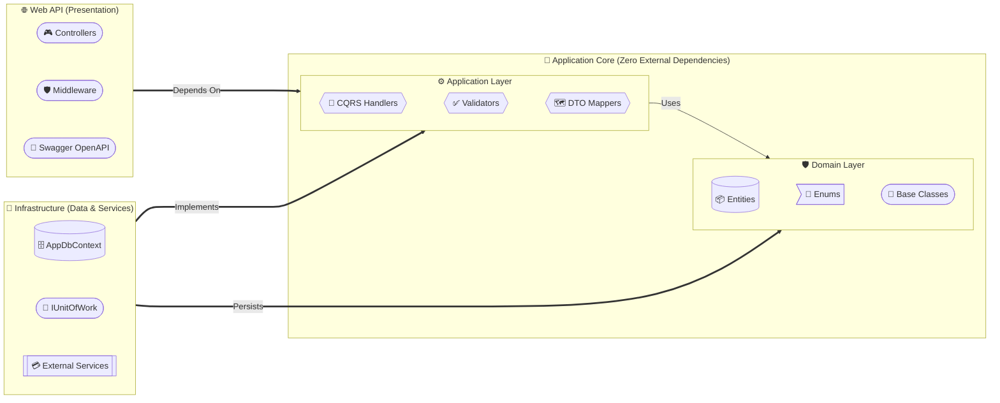
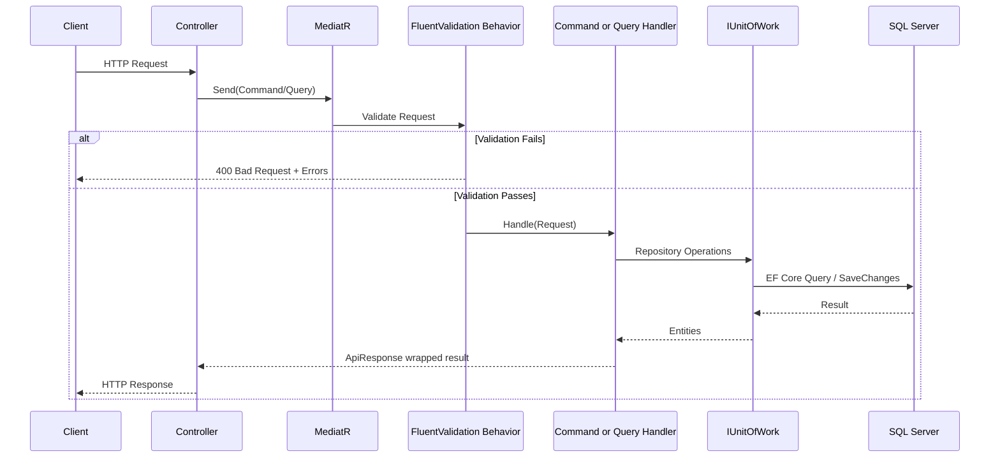
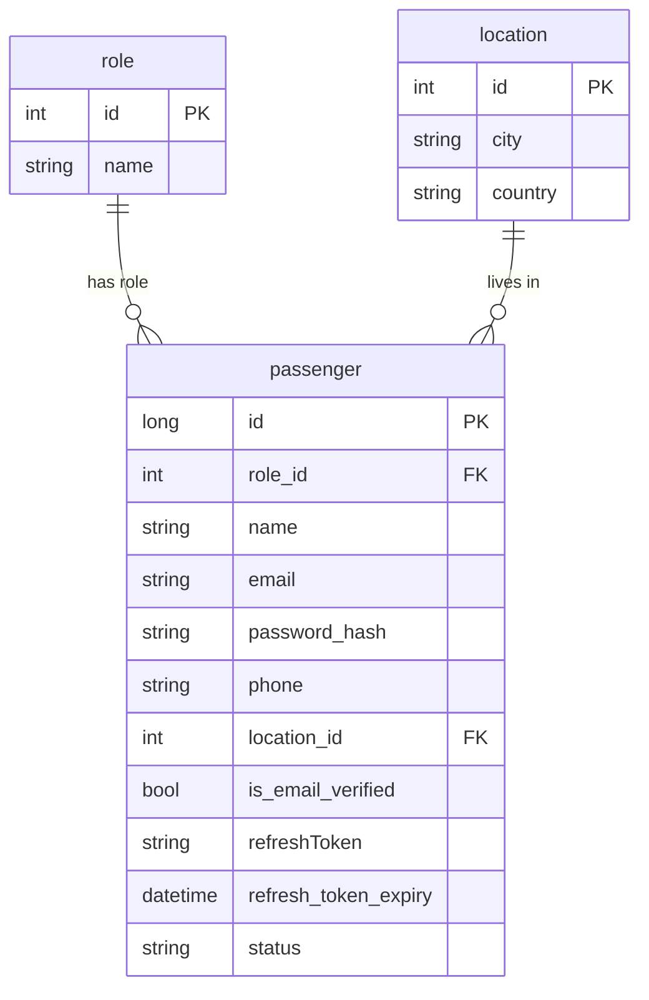
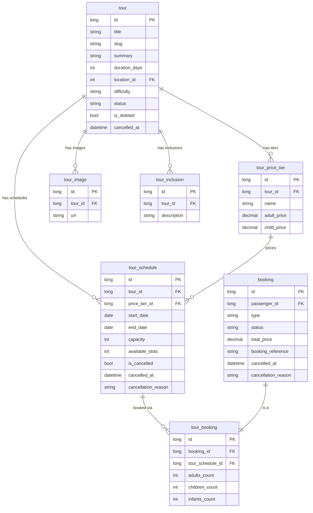
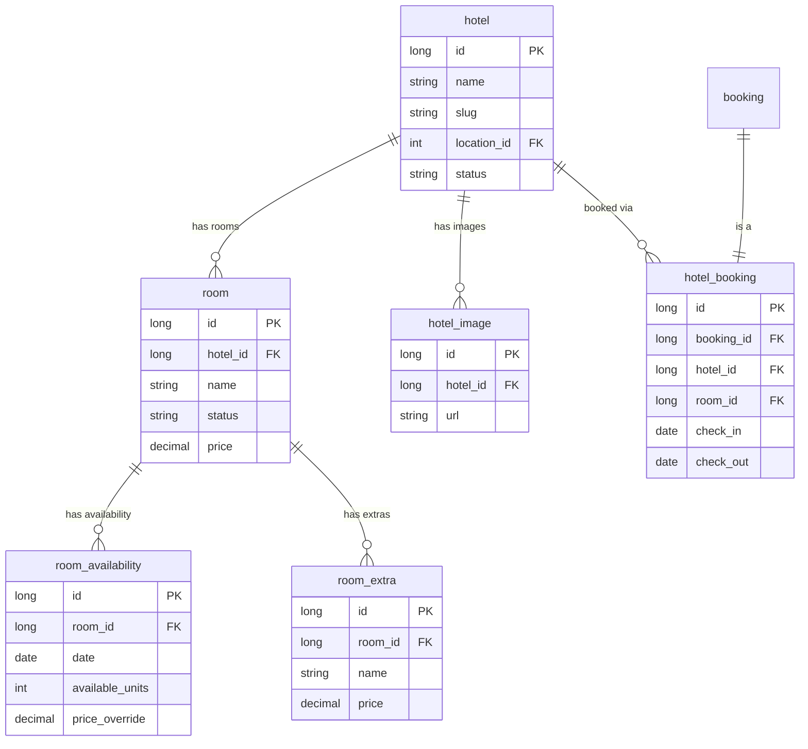
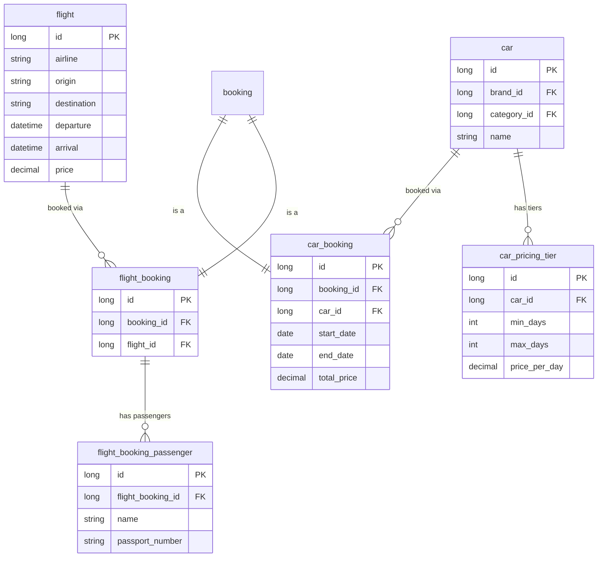
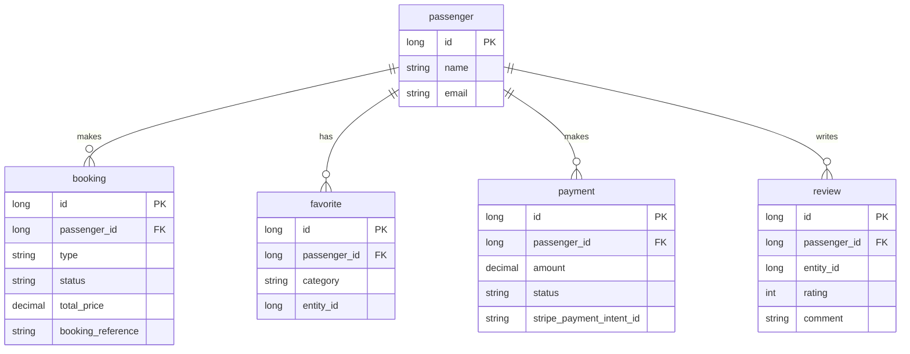
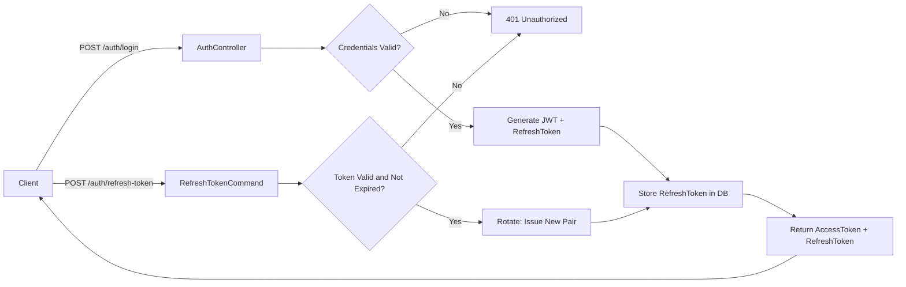

<div align="center">

<br/>

# ✈️ Online Travel Booking API

### *An enterprise-grade, full-featured travel platform backend built on .NET 10*

<br/>

[](https://dotnet.microsoft.com)
[](https://learn.microsoft.com/en-us/dotnet/csharp/)
[](https://learn.microsoft.com/en-us/ef/core/)
[](https://jwt.io)
[](https://stripe.com)
[](https://swagger.io)
[](https://github.com/jbogard/MediatR)
[](https://fluentvalidation.net)

<br/>

[](https://github.com/BolesGamel123/OnlineTravelBookingAPP)
[](https://github.com/BolesGamel123/OnlineTravelBookingAPP/forks)
[](https://github.com/BolesGamel123/OnlineTravelBookingAPP/issues)

<br/>

**[Overview](#-overview) • [Architecture](#-architecture--design-patterns) • [ERD](#-database-entity-relationship-diagram) • [Features](#-feature-modules) • [Security](#-security--authentication) • [Getting Started](#-getting-started) • [API Reference](#-api-reference) • [Contributing](#-contribution-guidelines)**

</div>

---

## 📖 Overview

The **Online Travel Booking API** is the backbone of a comprehensive, production-ready travel agency platform. It provides secure, high-performance RESTful endpoints that cover the complete lifecycle of a traveler's experience — from user authentication and admin catalog management, to booking complex tiered tours, hotel reservations, car rentals, flight bookings, and Stripe-powered payment processing.

Built on a **Modular Monolith** paradigm, the system strictly adheres to **Clean Architecture** and **Vertical Slice** principles. Every feature module is self-contained, highly testable, and designed to be independently extractable into a microservice as the platform scales.

---

## 🏛️ Architecture & Design Patterns

### Clean Architecture Layer Overview



### Request Pipeline



### Folder Structure (Vertical Slice)

```
OnlineTravelBookingAPP/
├── 🛡️ Domain/
│   ├── Common/          ← BaseEntity, AuditableEntity
│   ├── Entities/        ← 33 domain entities
│   └── Enums/           ← BookingStatus, TourStatus, FavoriteCategory ...
│
├── ⚙️ Application/
│   ├── Common/
│   │   ├── Behaviors/   ← MediatR Pipeline Behaviors (e.g., ValidationBehavior)
│   │   ├── Exceptions/  ← Custom Domain and Application Exceptions
│   │   ├── Interfaces/  ← IUnitOfWork, IRepository<T>, IJwtTokenGenerator ...
│   │   ├── Mappings/    ← AutoMapper profiles
│   │   ├── Models/      ← ApiResponse<T>, GenericResult<T>
│   │   ├── Pagination/  ← PaginatedList<T> and pagination helpers
│   │   ├── Patterns/    ← Common design pattern implementations
│   │   ├── Services/    ← Application-level shared services
│   │   └── Settings/    ← Strongly-typed configuration objects
│   └── Features/        ← One folder per vertical slice
│       ├── Auth/            Commands: Login | Register | RefreshToken | Logout
│       ├── Tours/           Commands: Create | Update | Delete | Queries: GetAll | GetById
│       ├── TourSchedules/   Commands: Create | AdminCancel
│       ├── TourBookings/    Commands: Create | Cancel | Update | Queries: GetAll | GetById
│       ├── Favorites/       Commands: Add | Remove | Queries: GetMy | Check
│       ├── Hotels/          Handlers: Search | Details | Create | Update | Delete
│       ├── HotelBooking/    Full booking lifecycle
│       ├── Rooms/           Room management + availability
│       ├── Flights/         Flight catalog
│       ├── Passengers/      Profile management
│       └── Payments/        Stripe payment intents + webhooks
│
├── 🔌 Infrastructure/
│   ├── Persistence/     ← AppDbContext, Repository, UnitOfWork
│   ├── Services/        ← CurrentUserService, StripeService, SlugService ...
│   └── Migrations/      ← EF Core migration history
│
└── 🌐 OnlineTravelBooking/
    ├── Controllers/     ← 12 API controllers
    └── Middleware/      ← Global exception handling
```

---

## 🗃️ Database Entity Relationship Diagram

### 👤 Users & Identity



### 🗺️ Tours Domain



### 🏨 Hotels Domain



### ✈️ Flights & 🚗 Cars Domain



### 🌟 Cross-Cutting Concerns



---

## 🚀 Feature Modules

| # | Module | Routes | Access |
|---|---|---|---|
| 1 | 🔐 **Auth** | `/api/auth` | Public |
| 2 | 👤 **Passengers** | `/api/passengers` | 🔒 Bearer |
| 3 | 🌟 **Favorites** | `/api/favorites` | 🔒 Bearer |
| 4 | 🗺️ **Tours** (Read) | `/api/tours` | Public |
| 5 | 🗺️ **Tours** (Write) | `/api/admin/tours` | 🔴 Admin |
| 6 | 🗓️ **Tour Schedules** | `/api/admin/tour-schedules` | 🔴 Admin |
| 7 | 🎫 **Tour Bookings** | `/api/tour-bookings` | 🔒 Bearer |
| 8 | 🏨 **Hotels** | `/api/hotels` | 🔒 Bearer |
| 9 | 🛏️ **Rooms** | `/api/rooms` | 🔒 Bearer |
| 10 | 🏨 **Hotel Bookings** | `/api/hotel-bookings` | 🔒 Bearer |
| 11 | ✈️ **Flights & Bookings** | `/api/flights` + `/api/flight-bookings` | 🔒 Bearer |
| 12 | 🚗 **Car Bookings** | `/api/car-bookings` | 🔒 Bearer |
| 13 | 💳 **Payments** | `/api/payments` | 🔒 Bearer |

### Key Highlights

- **🗓️ Tour Schedules** — Unique constraint `(tour_id, start_date, end_date)` prevents duplicates with `409 Conflict`. Admin cancel cascades to all active passenger bookings atomically.
- **🎫 Tour Bookings** — Tiered pricing engine: `(adults × adult_price) + (children × child_price)`. Inventory tracked via `available_slots`.
- **🌟 Favorites** — Supports Tours, Hotels, Flights, and Cars via `FavoriteCategory` enum. N+1-free projections.
- **💳 Payments** — Stripe payment intent creation + async webhook event handling.

---

## 🔐 Security & Authentication



| Feature | Detail |
| :--- | :--- |
| **Algorithm** | JWT Bearer with HS256 signing |
| **Identity Resolution** | `ICurrentIUserService` reads from `ClaimTypes.NameIdentifier` — never from the request body |
| **Token Rotation** | Every `/refresh-token` call issues a brand new `accessToken` + `refreshToken`, invalidating the old pair |
| **Access Token** | Long JWT string containing encoded claims (user ID, email, role) |
| **Refresh Token** | Short 32-character secure random string stored in the database |
| **Roles** | `Passenger` (default) and `Admin` — seeded via EF Core migration |

---

## 💻 Getting Started

### Prerequisites

- [.NET 10 SDK](https://dotnet.microsoft.com/download/dotnet/10.0)
- SQL Server LocalDB *(bundled with Visual Studio)* **or** SQL Server Developer Edition

### 1. Clone the Repository

```bash
git clone https://github.com/BolesGamel123/OnlineTravelBookingAPP.git
cd OnlineTravelBookingAPP
```

### 2. Configure the Application

Review `appsettings.Development.json` and update for your environment:

```json
{
  "ConnectionStrings": {
    "DefaultConnection": "Server=(localdb)\\MSSQLLocalDB;Database=OnlineTravelBooking;"
  },
  "JwtSettings": {
    "SecretKey": "your-super-secret-key-here",
    "Issuer": "OnlineTravelBookingAPI",
    "Audience": "OnlineTravelBookingClient",
    "ExpirationInMinutes": 60
  }
}
```

### 3. Apply Database Migrations

```bash
dotnet ef database update -p Infrastructure -s OnlineTravelBooking
```

> ⚠️ The migration `20260712092244_SeedDefaultRoles` seeds the `Admin` and `Passenger` roles. Always apply migrations **before** registering users.

### 4. Build & Launch

```bash
# Build
dotnet build OnlineTravelBooking/OnlineTravelBooking.csproj

# Run
dotnet run --project OnlineTravelBooking
```

Navigate to **[http://localhost:5183/swagger](http://localhost:5183/swagger)** to explore the interactive OpenAPI documentation.

---

## 📋 API Reference

### Unified Response Envelope

Every endpoint returns a typed `ApiResponse<T>`:

```json
{
  "success": true,
  "statusCode": 200,
  "message": "Tour booking created successfully.",
  "data": {
    "bookingReference": "TOUR-A3B7C9D1",
    "status": "Confirmed",
    "totalPrice": 1250.00
  },
  "errors": null
}
```

### Auth Endpoints

| Method | Route | Description |
|---|---|---|
| `POST` | `/api/auth/register` | Register a new passenger |
| `POST` | `/api/auth/login` | Login and receive JWT + refresh token |
| `POST` | `/api/auth/refresh-token` | Rotate tokens using a valid refresh token |
| `POST` | `/api/auth/logout` | Invalidate refresh token |

### Tour Endpoints

| Method | Route | Auth | Description |
|---|---|---|---|
| `GET` | `/api/tours` | Public | Paginated tour catalog |
| `GET` | `/api/tours/{id}` | Public | Tour details with schedules & pricing |
| `POST` | `/api/admin/tours` | Admin | Create a new tour |
| `PUT` | `/api/admin/tours/{id}` | Admin | Update tour details |
| `DELETE` | `/api/admin/tours/{id}` | Admin | Soft-delete a tour (cascades) |
| `POST` | `/api/admin/tours/{tourId}/schedules` | Admin | Add a schedule to a tour |
| `POST` | `/api/admin/tour-schedules/{id}/cancel` | Admin | Cancel schedule + cascade bookings |

---

## 🤝 Contribution Guidelines

When contributing, adhere strictly to the **Vertical Slice Architecture**:

```
Application/Features/{FeatureName}/
├── Commands/
│   └── {ActionName}/
│       └── {ActionName}Command.cs   ← Record + Validator + Handler (one file)
├── Queries/
│   └── {ActionName}/
│       └── {ActionName}Query.cs     ← Record + Validator + Handler (one file)
├── DTOs/                            ← Response/Read models
└── Requests/                        ← Controller input models
```

### Golden Rules

1. ✅ **Always use `IUnitOfWork`** — Never inject `AppDbContext` directly into handlers.
2. ✅ **Always validate** — Every command/query must have an `AbstractValidator<T>`.
3. ✅ **Always wrap responses** — Return `ApiResponse<T>` from every controller action.
4. ✅ **Enums as strings** — All enums use `JsonStringEnumConverter`.
5. ✅ **No ID spoofing** — Resolve the current user from `ICurrentIUserService`, never from request body.

---

<div align="center">
  <br/>

  ```
  Built with ❤️ using .NET 10 · Clean Architecture · CQRS · MediatR · EF Core
  ```

  <sub>© 2026 Online Travel Booking API — All Rights Reserved</sub>

  <br/>
</div>
